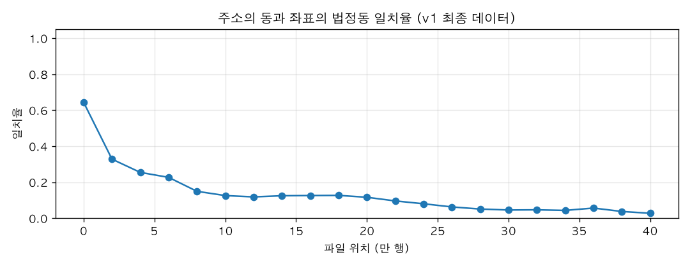
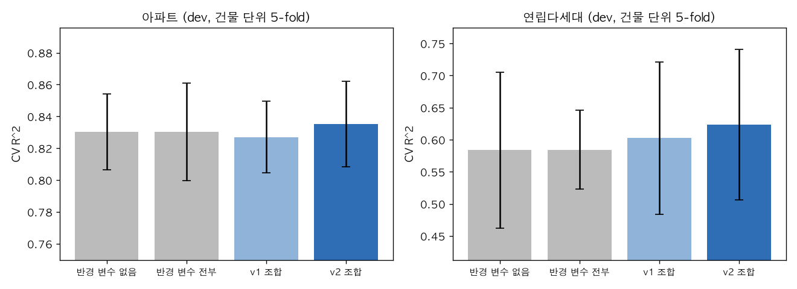
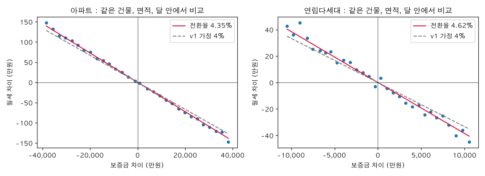
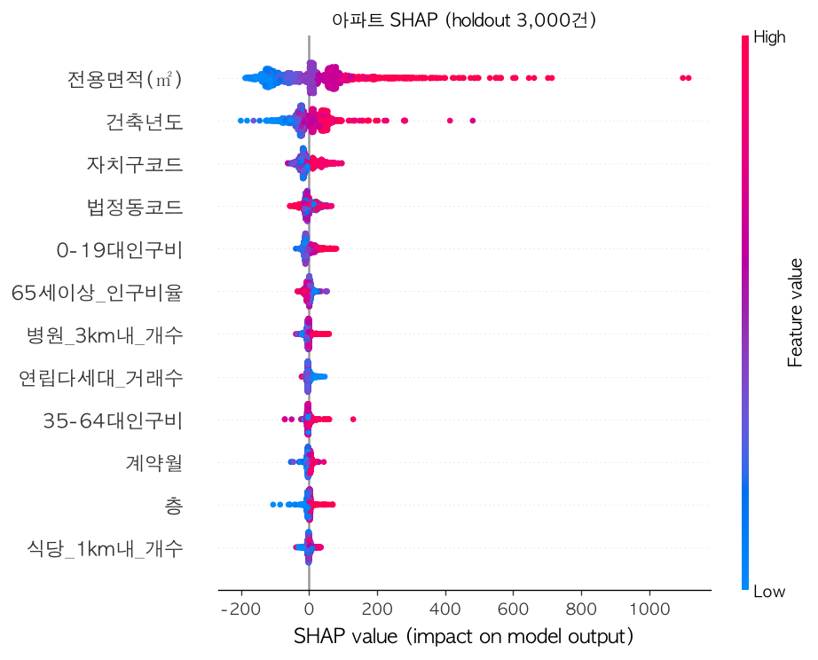
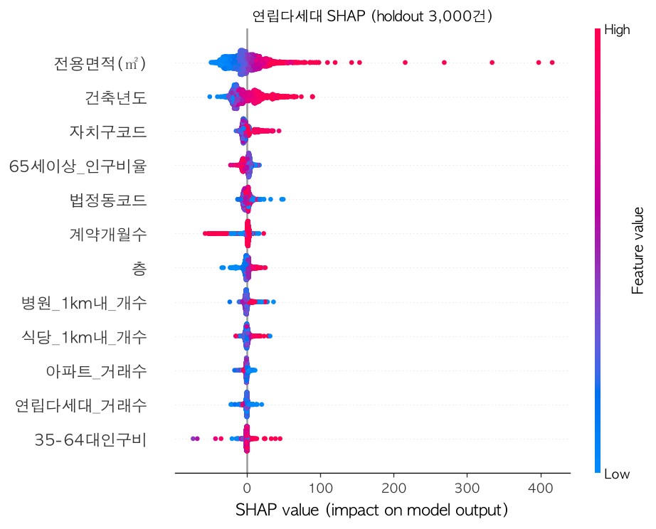
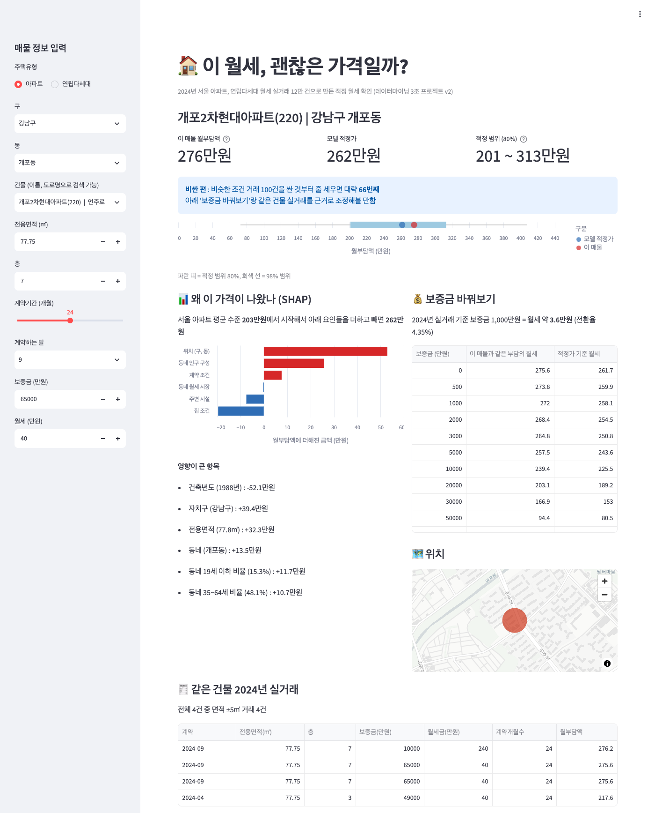

## v2 : 다시 보고 고친 것들
v1(팀 프로젝트) 결과를 다시 정리하다가 데이터부터 다시 확인하면서 바로잡은 내용  
v1 결과는 [메인 README](../README.md)에 그대로 둠

### 한눈에 보기
| | v1 | v2 |
| -- | -- | -- |
| 데이터 | 413,720행 (같은 거래가 평균 3.6행, 좌표 대부분 다른 거래 것) | 122,019건 (거래 1건 = 1행, 주소에 맞게 좌표 복구) |
| 검증 | 거래 단위 무작위 분할, 반경 조합을 test 성적으로 고름 | 건물 단위 5-fold로 고르고, 처음 보는 건물 20%로 마지막에 한 번 시험 |
| 월부담액 | 전환율 4% 가정 | 실거래에서 찾은 전환율 (아파트 4.35%, 연립다세대 4.62%) |
| 아파트 R^2 | 0.9352 | 처음 보는 건물 0.816 / 거래 있던 건물 0.939 |
| 연립다세대 R^2 | 0.8528 | 처음 보는 건물 0.608 / 거래 있던 건물 0.753 |
| 결과물 | SHAP 요인 분석 프로토타입 | 적정 월세 확인 화면 (streamlit) |

#### 파일 구성
```
v2/
├── 01_data_fix.ipynb      # 중복, 좌표 어긋남 확인 -> 원본에서 다시 만들기
├── 02_validation.ipynb    # 무작위 vs 건물 단위, holdout 떼어두기, 반경 다시 고르기
├── 03_model.ipynb         # 전환율 찾기, 튜닝, 최종 시험, SHAP
├── data/                  # apt_vil_combined(원본 합본), rent_v2(다시 만든 데이터), 주소_좌표_복구 등
├── images/
└── streamlit/             # build_service.py(모델, 화면 데이터), app.py(화면)
```
노트북은 ```v2/``` 폴더에서 실행 (```requirements.txt```). 01, 02는 git lfs로 받은 ```data/output/final_season_added.csv```가 필요함

------------
### 1. 데이터 다시 보기 ([01_data_fix.ipynb](01_data_fix.ipynb))

#### 이상한 점
- 원본 월세 거래는 136,525건인데 최종 데이터는 413,720행
- 완전히 똑같은 행이 289,924행

<pre>
고유 거래 수          : 116271
거래 1건당 평균 행 수 : 3.56
</pre>

#### 원인 1. 법정동 이름으로 merge 해서 행이 늘어남
행정동 코드를 붙일 때 **법정동 이름**으로 merge 했었음
```python
df00 = df00.merge(dong_subset, on="법정동", how="left")
```
- ```동_통합KIKmix``` 표에서 법정동 1개가 행정동 여러 개로 나뉨 -> 거래 1건이 행정동 수만큼 복제 (```신당동```은 6행)
- 복제된 횟수가 매핑표 행 수랑 같은 경우가 96.7%
- merge 전후로 행 수만 찍어봤어도 바로 보였을 문제라, v2에서는 단계마다 행 수를 찍으면서 진행함

#### 원인 2. 거래랑 좌표가 서로 다른 행에 붙음

- ```동```(주소에서 나온 값) == ```법정동```(좌표를 공간 조인해서 나온 값)인 행이 13.9%뿐
- 7460행부터 좌표 쪽이 한 칸씩 밀리고 뒤로 갈수록 더 밀림 (최대 30행 정도)
- 그런데 같은 좌표면 병원 개수, 인구비율 같은 입지 값은 전부 같음 -> **입지 계산은 맞았고 거래랑 좌표의 짝만 어긋난 것**

#### 다시 만들기
1. 원본(```apt_vil_combined.csv```)에서 v1 필터 그대로 다시 적용 -> 122,474건 (v1 노트북이랑 같은 수)
2. 주소 - 좌표 짝 복구
   - 같은 주소는 파일 안에서 날짜별로 여러 번 나옴
   - 주소가 나올 때마다 근처(-30 ~ +120행)에 있는 **같은 법정동** 좌표에 투표
   - 동마다 "주소 1개 = 좌표 1개"가 되게 매칭 (헝가리안 알고리즘)
3. 입지 변수는 복구한 좌표 기준으로 v1 값 그대로, ```법정동코드```는 (구, 동)으로 다시, 거래수는 중복 없는 데이터로 다시 셈

#### 검증
<pre>
정상 구간(0~7459행) 정답과 같은 비율    : 0.9991  (주소 1,155개)
도로명 주소가 같은 건물의 좌표 거리 중앙값 : 3521m -> 45m  (300m 이내 10.0% -> 98.4%)
공원 개수 다시 계산해서 일치율           : 1.0
</pre>
-> 최종 **122,019건** (아파트 58,985 / 연립다세대 63,034), 원본 필터 후 거래의 99.6%

------------
### 2. 검증 다시 하기 ([02_validation.ipynb](02_validation.ipynb))
v1은 ```train_test_split```으로 거래를 무작위로 나눔. 아파트는 단지 하나에 거래가 평균 11건이라 test 거래 대부분이 train에 같은 단지 거래를 갖고 있음  
-> 같은 건물(지번, 도로명 주소, 아파트는 단지명)을 묶어서 **건물 단위**로 나눔

#### 같은 변수, 같은 XGBoost 기본값으로 비교 (v2 데이터)
| | 무작위 분할 (v1 방식) | 건물 단위 5-fold |
| -- | -- | -- |
| 아파트 R^2 | 0.9314 | 0.8322 |
| 연립다세대 R^2 | 0.7580 | 0.6364 |

#### 기존 데이터의 0.93은?
<pre>
기존 데이터, 아파트, 무작위 분할 Test R^2 : 0.9296
test 행 중 train에 똑같은 행이 있는 비율 : 0.894
</pre>
-> test 대부분이 train에 복사본이 있었음

#### 최종 시험용 건물 20% 떼어두기
v1에서는 반경 조합을 test 성적으로 골라서 test가 사실상 "고르는 데" 쓰였음  
v2는 건물 20%를 먼저 떼어두고(holdout), 반경, 튜닝, 변수 선택은 나머지 80%(dev) 안에서 건물 단위 5-fold로만 정함. holdout은 03 마지막에 한 번만 씀

#### 반경 조합 다시 고르기
1,080개를 건물 단위 5-fold로 다 돌리면 너무 오래 걸려서, v1 조합에서 시작해 그룹 하나씩만 바꿔보고 좋아지면 바꾸는 방식으로 찾음



| 주택유형 | v1 조합 | v2 조합 | 반경 변수 없음 | fold 표준편차 |
| -- | -- | -- | -- | -- |
| 아파트 | 0.8270 | 0.8351 | 0.8304 | 0.02 ~ 0.03 |
| 연립다세대 | 0.6024 | 0.6233 | 0.5837 | 0.06 ~ 0.12 |

- v2 조합
  - 아파트 : ```병원_3km```, ```역_500m```, ```식당_1km```, ```공원_800m```, ```파출소/지구대_1km```, ```대학_1km```
  - 연립다세대 : ```병원_1km```, ```역_1km```, ```식당_1km```, ```공원_800m```, ```파출소/지구대_0.5km```, ```대학_2km```
- 다시 고르면 조금 좋아지긴 하는데 fold 간 편차보다 작음. 반경을 아예 안 넣어도 아파트는 거의 같음  
  -> 반경을 어떻게 고르냐보다 **데이터랑 검증 방식**이 훨씬 큰 차이를 만들었음

------------
### 3. 월부담액, 모델 다듬기 ([03_model.ipynb](03_model.ipynb))

#### 전환율 4% -> 실거래에서 찾기
같은 건물, 같은 면적, 같은 달에 보증금이 다른 계약끼리 비교 (그룹 평균 빼고 회귀, 층도 같이 넣어서 통제)
$$
\text{월세} = a - \frac{\text{전환율}}{12} \times \text{보증금} + b \times \text{층}
$$


<pre>
아파트 : 전환율 4.35%  (비교한 거래 29580건, 그룹 8451개)
연립다세대 : 전환율 4.62%  (비교한 거래 4257건, 그룹 1730개)
</pre>
- 둘 다 4%보다 조금 높음 (참고로 계약 중에 보증금 일부를 월세로 돌릴 때 법정 상한이 기준금리 + 2%p, 2024년 기준 5.0~5.5%)
- 4%로 해도 성능이나 중요 변수 순위는 거의 같아서 v1 결론이 바뀌진 않음
- 그래도 서비스에서 "보증금 1,000만원 = 월세 몇 만원"을 계산할 때는 실제 비율이 맞아야 해서 v2부터는 찾은 값으로 씀
- 보증금 크기별로 보면 아파트는 4.1~4.8%로 비슷한데, 연립다세대는 보증금 3천만원 미만에서 보증금이 달라도 월세가 거의 안 바뀜(0%) -> 작은 보증금은 가격보다 담보 성격으로 보임

#### 튜닝 (dev, 건물 단위 5-fold)
| 주택유형 | 설정 | CV R^2 | MAE | 평균 오차율 |
| -- | -- | -- | -- | -- |
| 아파트 | P0 (v1 기본값) | 0.8363 | 35.79 | 23.3% |
| 아파트 | P1 | 0.8466 | 33.10 | 21.9% |
| 연립다세대 | P0 (v1 기본값) | 0.6189 | 17.40 | 22.4% |
| 연립다세대 | P1 | 0.6628 | 17.04 | 22.0% |

- P1 : 트리 800개, 학습률 0.05, 깊이 8, ```min_child_weight``` 5, ```subsample```, ```colsample_bytree``` 0.8
- 트리를 더 늘린 P2도 해봤는데 오차율이 거의 같아서 학습이 빠른 P1로 통일

#### 넣어봤는데 뺀 것
- ```위도```, ```경도``` : 아파트 R^2 0.8466 -> 0.8547, 연립 0.6628 -> 0.6781로 조금 좋아지긴 함
  - 그런데 fold 표준편차(0.03, 0.09)보다 작고, SHAP으로 설명하면 "위도 +5만원" 같은 식이라 세입자한테 설명이 안 됨
  - 이 프로젝트는 **왜 그 가격인지 설명하는 것**이 중요해서 설명 되는 변수만 남기고 뺌
- ```주변_㎡당월부담액``` (반경 1km 안 다른 건물 평균, fold마다 train 건물로만 계산) : 오히려 나빠져서 뺌

#### 최종 시험 (처음 보는 holdout 건물, 한 번만)
| 주택유형 | 설정 | MAE | R^2 | 평균 오차율 | 오차율 중앙값 |
| -- | -- | -- | -- | -- | -- |
| 아파트 | v1 설정 (기본값, v1 반경) | 39.64 | 0.8221 | 23.5% | 12.8% |
| 아파트 | v2 설정 (P1, v2 반경) | 37.81 | 0.8155 | 21.6% | 11.8% |
| 연립다세대 | v1 설정 (기본값, v1 반경) | 16.22 | 0.5893 | 21.6% | 12.6% |
| 연립다세대 | v2 설정 (P1, v2 반경) | 15.82 | 0.6084 | 21.0% | 12.6% |

(holdout 아파트 11,613건, 연립다세대 12,601건, 둘 다 v2 데이터로 같은 타겟)

- 처음 보는 건물 기준으로 v2 설정이 MAE, 평균 오차율, 오차율 중앙값 다 좋아짐
- 아파트 R^2는 오히려 조금 낮음(0.822 -> 0.816). RMSE도 같이 커진 걸 보면 아주 비싼 집 몇 건에서 크게 틀린 영향 (R^2는 큰 오차 몇 개에 많이 흔들려서 오차율을 같이 봄)
- 처음 보는 건물이면 보통 12% 정도 틀림 (오차율 중앙값)
- 거래가 있던 건물의 새 계약이면 (거래 단위 무작위 5-fold)

<pre>
아파트     : R^2 0.9390, 오차율 중앙값 7.0%
연립다세대 : R^2 0.7529, 오차율 중앙값 10.7%
</pre>
-> v1의 0.93은 이 상황(이미 본 건물) + 복사본이 섞인 숫자였음
- 월부담액이 아주 낮은 구간(하위 20%)은 평균 오차율이 40%대. 공공임대처럼 시세랑 다르게 정해진 거래가 섞여 있어서로 보임 (v1 때도 걸러보려다 구분이 어려워서 못 걸렀던 부분)

#### SHAP으로 다시 해석
holdout 건물 3,000건으로 계산. 값 단위가 만원이라 "평균적으로 월부담액을 몇 만원 움직였는지"로 읽으면 됨



#### < SHAP 순위 ver.아파트 >
| 순위 | 변수 | 평균 영향 | 방향 |
| -- | -- | -- | -- |
| 1 | 전용면적 | 84.1만원 | 넓을수록 비쌈 |
| 2 | 건축년도 | 34.5만원 | 신축일수록 비쌈 |
| 3 | 자치구 | 21.5만원 | 강남 3구 쪽이 비쌈 |
| 4 | 법정동 | 12.7만원 | 같은 구 안에서도 동네 차이 |
| 5 | 19세 이하 인구 비율 | 12.5만원 | 높을수록 비쌈 |
| 6 | 65세 이상 인구 비율 | 5.6만원 | 높을수록 쌈 |
| 7 | 3km 안 병원 수 | 5.1만원 | 많을수록 비쌈 |

<해석>
1. 면적, 연식, 위치(구, 동)가 거의 다 설명함. v1이랑 같지만 건축년도가 더 위로 올라옴
2. 19세 이하 비율이 높은 동네가 비쌈 -> 아이 있는 가족이 모이는 동네(학군 수요)로 보임. v1에서는 안 보였던 부분
3. v1에서 6, 7위였던 ```공원_800m```, ```역_500m```은 v2에서 상위권에 없음 -> v1의 "숲세권, 역세권" 해석은 좌표가 어긋난 데이터에서 나온 거라 근거가 약해짐. 역, 공원 효과는 자치구, 법정동(위치)에 이미 들어가 있는 것으로 보임



#### < SHAP 순위 ver.연립다세대 >
| 순위 | 변수 | 평균 영향 | 방향 |
| -- | -- | -- | -- |
| 1 | 전용면적 | 17.0만원 | 넓을수록 비쌈 |
| 2 | 건축년도 | 15.0만원 | 신축일수록 비쌈 |
| 3 | 자치구 | 4.9만원 | 강남 3구 쪽이 비쌈 |
| 4 | 65세 이상 인구 비율 | 3.5만원 | 높을수록 쌈 |
| 5 | 법정동 | 3.1만원 | 동네 차이 |
| 6 | 계약개월수 | 2.9만원 | 계약기간이 길면 많이 쌈 |
| 7 | 층 | 2.9만원 | 반지하, 저층이 쌈 |

<해석>
1. 연식이 면적이랑 거의 같은 크기로 중요함 -> 연립은 노후 차이가 커서 (v1에서도 1위였음)
2. 65세 이상 비율이 높으면 쌈 -> v1 해석(고령층 주거지)이랑 같음
3. 계약기간이 긴 거래가 많이 쌈 -> v1 전처리 때 얘기했던 공공임대(행복주택, 청년주택 등 장기 계약)가 섞여 있는 영향으로 보임
4. v1에서 2위였던 ```아파트_거래수```는 v2에서 상위권이 아님 (v1 거래수는 중복된 행으로 센 값이었음)

#### < 정리 : v1 vs v2 해석 >
| 항목 | v1 | v2 |
| -- | -- | -- |
| 아파트 주요 요인 | 면적, 구, 연식, 층, 동, 공원, 역 | 면적, 연식, 구, 동, 19세 이하 비율 |
| 연립 주요 요인 | 연식, 아파트 거래수, 면적, 구 | 면적, 연식, 구, 65세 이상 비율 |
| 역, 공원 | 아파트에서 중요 | 위치(구, 동)에 이미 들어가 있어서 따로는 작음 |
| 새로 보인 것 | - | 학군 수요(아파트), 장기 계약 공공임대(연립) |

------------
### 4. 적정 월세 확인 화면 ([streamlit](streamlit/))
v1 시사점에 썼던 "세입자의 합리적 주거 판단 지원", "정량 모델 기반 협상력 확보"를 실제로 쓸 수 있는 화면으로 만듦  
(2024년 데이터 기준, 그 당시에 바로 쓸 수 있는 수준까지)



#### 누가 쓰나
- 서울에서 처음 월세 구하는 사회초년생, 대학생
- 전세사기 이후 월세로 오는 사람은 늘었는데 "이 가격이 괜찮은지" 판단할 기준이 없음 (v1 배경이랑 같은 문제)

#### 뭘 해주나
1. **이 매물 월부담액 vs 적정 범위** : 비슷한 조건 거래 100건을 싼 것부터 줄 세우면 몇 번째쯤인지
2. **왜 이 가격인지** : SHAP으로 집 조건, 위치, 주변 시설, 동네 인구 등이 각각 몇 만원씩 더하고 뺐는지
3. **보증금 바꿔보기** : 보증금을 올리거나 내리면 월세가 얼마여야 같은 부담인지 (찾은 전환율로 계산)
4. **같은 건물 실거래** : 면적 비슷한 2024년 거래
5. 시세보다 많이 싸면 등기부등본(근저당, 압류), 건축물대장(위반건축물) 확인하라고 안내

#### 적정 범위는 어떻게
- 화면에서는 2024년에 거래가 있던 건물만 고를 수 있음 -> "거래가 있던 건물의 새 계약"을 맞히는 상황
- 그래서 범위는 거래 단위 무작위 5-fold에서 모델이 틀린 정도(실제/예측 비율)로 잡은 80% 범위
- 같은 건물의 다른 거래가 많을수록 범위가 좁아져서, 다른 거래 수(0건, 1~4건, 5~19건, 20건 이상)별로 따로 잡음

<pre>
아파트     : 같은 건물 다른 거래 1~4건 -> 예측 x 0.77 ~ 1.20,  20건 이상 -> 예측 x 0.86 ~ 1.13
연립다세대 : 같은 건물 다른 거래 1~4건 -> 예측 x 0.77 ~ 1.21,  20건 이상 -> 예측 x 0.91 ~ 1.09
</pre>

#### 화면 예시 (위 그림)
- 강남구 개포동 개포2차현대 77.75㎡, 보증금 6억 5천 / 월세 40 -> 월부담액 276만원, 적정 범위 201 ~ 313만원, 싼 것부터 66번째 -> "비싼 편"
- 같은 건물 실거래를 보면 보증금 1억 / 월세 240 (월부담액 276.2만원)이랑 보증금 6억 5천 / 월세 40 (275.6만원)이 거의 같게 나옴 -> 실거래에서 찾은 전환율이 실제 보증금, 월세 조합이랑 잘 맞음

#### 비즈니스로 보면
| 누가 | 어떻게 쓰나 |
| -- | -- |
| 세입자 | 계약 전에 적정 범위랑 같은 건물 실거래를 근거로 가격 협상 |
| 부동산 플랫폼 | 매물 상세에 "적정가 범위" 표시, 시세보다 많이 싸거나 비싼 매물 따로 표시 (허위, 미끼 매물 거르기) |
| 공공 상담 창구 | 전월세 상담할 때 근거 자료로 활용 |

#### 실행
```
cd v2/streamlit
pip install -r requirements.txt
streamlit run app.py
```

------------
### 한계, 다음에 할 것
- 2024년 거래만 써서 그 뒤 시세 변화는 반영 안 됨. 실제로 운영하려면 매달 실거래를 받아서 다시 학습하고, 새 거래에서 오차가 커지는지(데이터 drift) 계속 봐야 함
- 화면은 2024년에 거래가 있던 건물만 고를 수 있음. 처음 보는 건물은 오차가 더 큼 (holdout 결과)
- 연립다세대는 극단적으로 비싼 거래 몇 건 때문에 R^2가 fold마다 크게 흔들림. 그래서 오차율도 같이 봄
- 호수 정보가 없어서 같은 날 같은 층 같은 금액 계약(6,149행)은 구분 못 하고 그대로 둠
- 공공임대(행복주택, 청년주택 등)를 아직 못 걸러서 월부담액이 아주 낮은 구간은 오차가 큼
- 연립다세대 보증금 3천만원 미만은 실제 전환율이 거의 0%라서 "보증금 바꿔보기" 환산이 덜 맞을 수 있음
- 식당, 병원, 파출소, 대학 개수는 v1에서 계산한 값을 좌표 기준으로 다시 붙인 것 (공원만 원본으로 다시 계산해서 확인)
